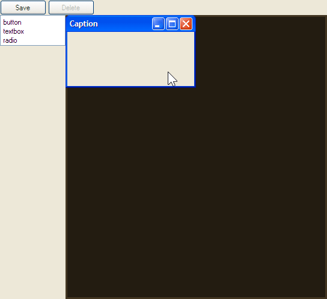
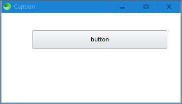

# Position Absolute WYSIWYG Editor

:construction: Work in progress.

For prototyping desktop GUIs in HTML.

The resulting HTML file is to be opened with the [Sciter](https://github.com/c-smile/sciter-sdk) program [scapp.exe](https://github.com/c-smile/sciter-sdk/tree/master/bin.win/x64), not a web browser.

**WYSIWYG** What You See Is What You Get

**GUI**: Graphical User Interface

## Preview

**Result**:

